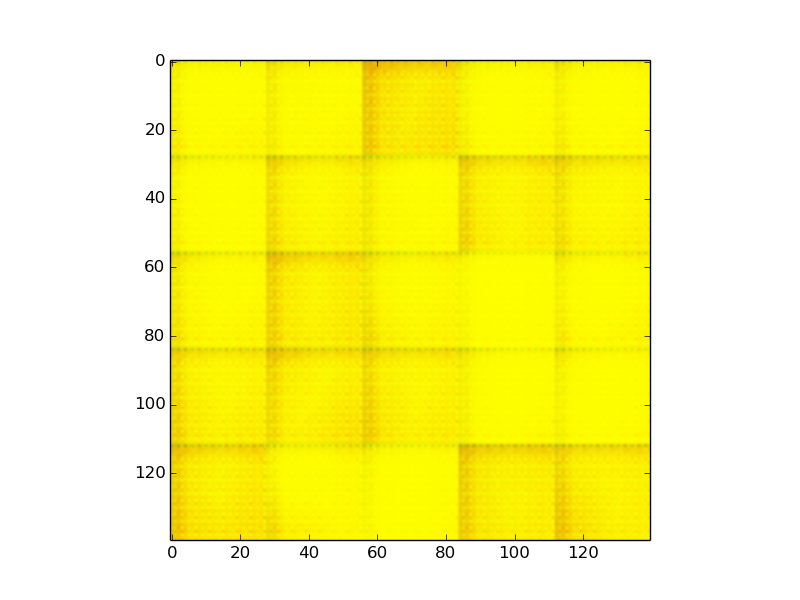
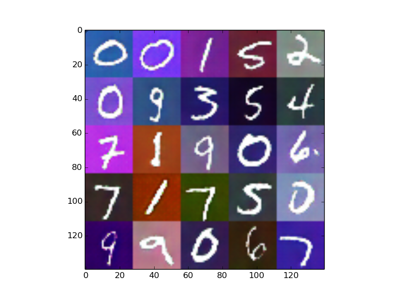
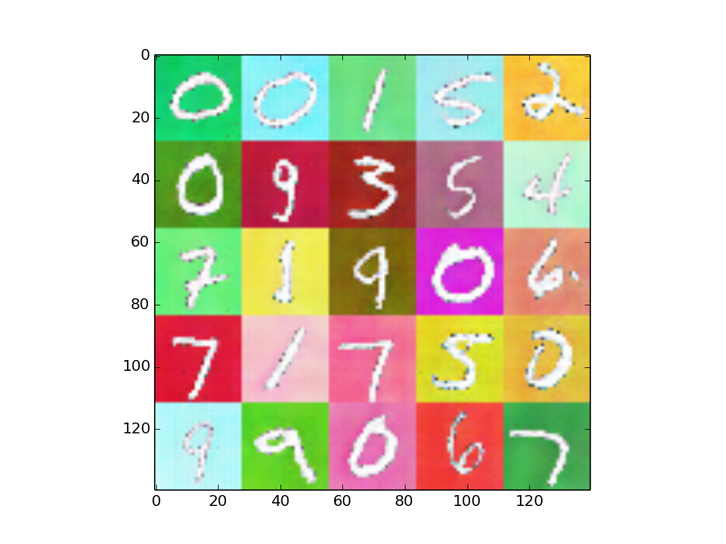
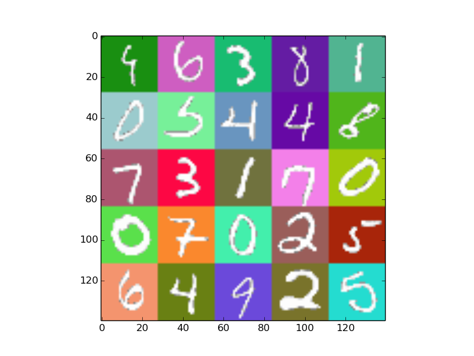
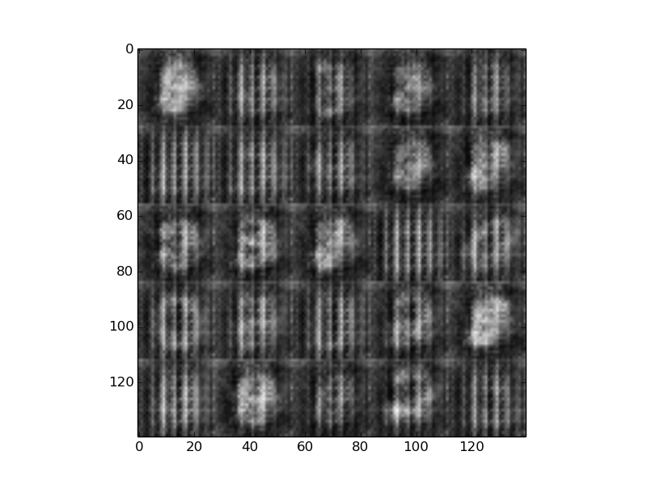
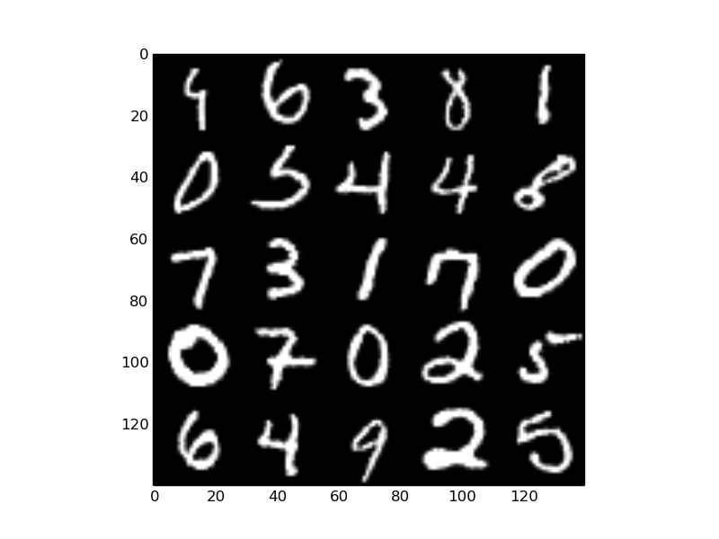
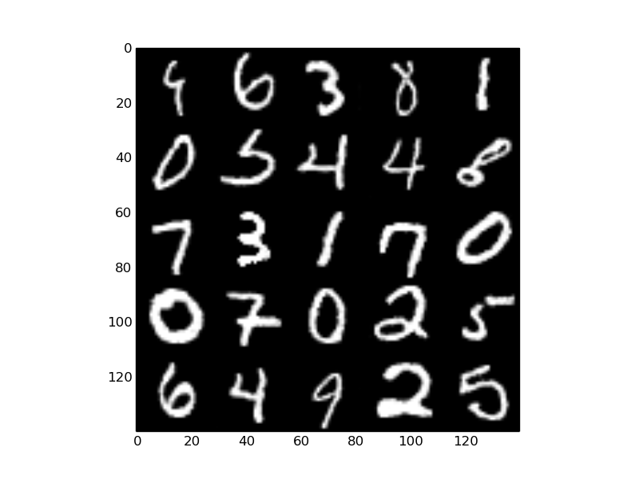
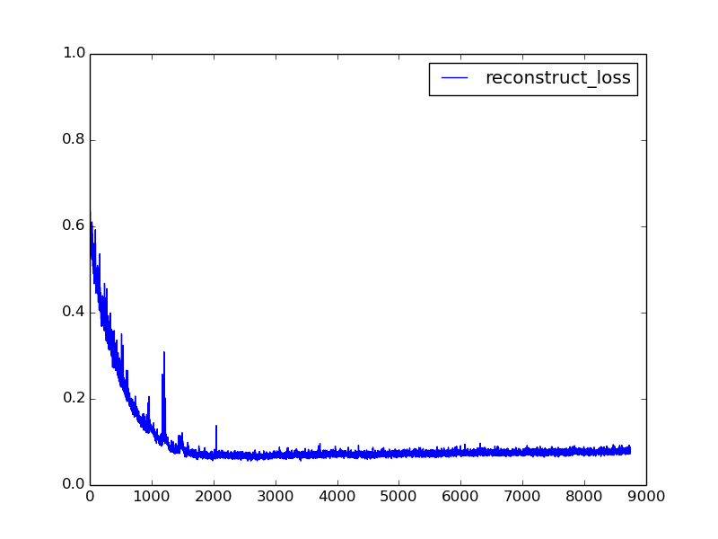
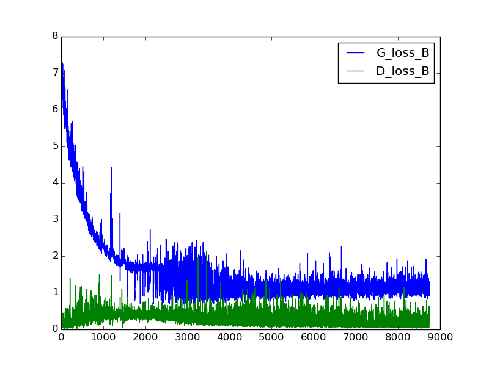

# Domain Transfer with CycleGAN

Use CycleGAN to transform **gray MNIST** to **colorful MNIST**.


## Prepare Data

1. Download `mnist.npz` from https://storage.googleapis.com/tensorflow/tf-keras-datasets/mnist.npz, put it into `data/mnist`.
2. run `gen_color_mnist.py`.

```python
    python gen_color_mnist.py
```

## Train and Transform

1. run `cyclegan.py`.

```python
    python cyclegan.py
```

---

## Transformed Images

input | Epoch 0 | Epoch 40 | Epoch 99
:---: | :---: | :---:  | :---:
 |  |  | 
 |  |  | 

## Loss plots

reconstruct loss | G&D loss A | G&D loss B |
:---: | :---: | :---:
 |  | 


## Reference

1. [Understanding and Implementing CycleGAN in TensorFlow](https://hardikbansal.github.io/CycleGANBlog/)
2. [CycleGAN-tensorflow](https://github.com/hardikbansal/CycleGAN/)